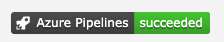

# Pipilene of Azure devops on Televison

## First

It's used the URL get from the pipeline on "Status Badge" of the pipeline

```
https://{organization}.visualstudio.com/{project}/_apis/build/status/{repository-name}/{pipeline-name}?branchName={branch-name}
```



## Second

You need to create a `file` on `src` folder, named "pipelines.js" with the following structure, and add one or more objects:

```
export const pipelines = [
  {
    title: "project-name (or whathever)",
    url:
      "url of the Status Badge"
  }
];
```
